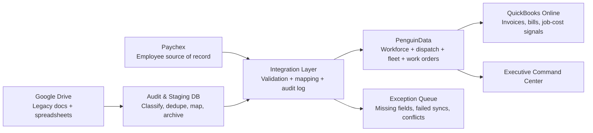

# Southern Tier Operations Command Center Research Brief

## Executive summary

Southern Tier Telecommunications appears to be a privately held, field-heavy telecom construction and fulfillment company centered in Southwest Florida but operating across multiple states. Public company materials describe STT as a turnkey telecom provider for fiber, wireless, OSP, aerial and underground work; LinkedIn lists it as a Fort Myers-headquartered telecommunications company with 51–200 employees, 1,157 followers, and a primary address on Metro Parkway in Fort Myers, while the official website claims 16 offices nationwide, 300+ completed projects, and 30 years of experience. Florida corporate records show an active foreign corporation filing with Bradley T. Miller as president and David R. Brainard as COO. In other words, the believable story for your demo is not “small local contractor,” but “growing multi-state execution company with mobile crews, rising operational complexity, and leadership trying to professionalize the back office fast.” citeturn2view0turn1view0turn10view1turn20search0

The most important signal from the company’s public footprint is not just what STT does, but how it presents itself. Its public updates emphasize rapid execution, field pride, Ohio and Nevada fiber work, a newly christened headquarters, and attendance at Fiber Connect 2026. At the same time, parts of the website are clearly unfinished or placeholder-driven, including a “What’s New” page that says updates are “on the way” and a customer section populated with generic items such as “City skyline” and “John Doe.” That combination makes your strongest demo concept very clear: an internal command center that feels more mature than the public site, and that visibly solves the exact scaling problem leadership knows it has. citeturn23search0turn11view0turn1view0

The interview brief you shared fits that pattern exactly. The company says that a decade of HR, fleet, and project data has piled up into a “junk drawer” inside Google Drive, and that it wants Paychex to be the source of truth for hiring and payroll finalization, PenguinData for workforce and fleet operations, and QuickBooks for finance, while still remaining open to a better architecture. That is a classic field-operations integration problem: labor is expensive, schedules are fluid, projects run across crews and vehicles, and data quality failures create payroll errors, assignment mistakes, and billing leakage. Industry benchmarks reinforce how costly those misses are: in the 2025 Fiber Deployment Cost Annual Report, labor represented about 72% of underground deployment cost and 64% of aerial cost, while median deployment costs were $18/ft underground and $8/ft aerial; 92% of respondents said costs rose in 2025, and 88% expected them to rise again in 2026. citeturn22search2turn22search4turn7view0

For tomorrow’s interview, the highest-impact deliverable is **not** a fake all-purpose ERP. It is a premium, boardroom-ready **Southern Tier Operations Command Center** with simulated yet credible data, built around five highly believable scenes: executive KPI overview, new-hire automation, fleet and work-order operations, Google Drive cleanup and migration, and integration health with exception handling. That approach shows strategic judgment, understands the company’s real operating model, and gives executives something they can immediately imagine using. The recommended build tonight is a focused 6–8 hour prototype with 9–10 polished features, not a broad 12+ hour pseudo-product. citeturn2view0turn14view3turn14view4turn14view5turn7view3

## Southern Tier company snapshot

The most useful public facts about STT are summarized below. Where the public record is inconsistent or incomplete, that is noted directly.

| Topic | Public signal | What it means for your demo |
|---|---|---|
| Company identity | STT presents itself as a turnkey telecom contractor covering wireless, OSP, fulfillment, fiber, aerial and underground construction. citeturn2view0turn1view0turn10view0 | Build around field execution, not consumer telecom or carrier network operations. |
| Headquarters and footprint | LinkedIn lists headquarters in Fort Myers, Florida, with primary address 11760 Metro Pkwy. Florida corporate records show an active filing with a Cape Coral principal address. citeturn2view0turn10view1 | Use a multi-location operating model. Do not make the UI feel like a single-yard local contractor tool. |
| Size | LinkedIn lists 51–200 employees; exact headcount is not publicly specified. citeturn2view0 | Simulated employee counts in the 90–130 range will feel believable. |
| Scale claims | STT’s website claims 16 offices nationwide and 300+ completed projects. citeturn1view0 | A prototype showing multi-region rollout, project portfolio views, and office/crew filters will feel grounded. |
| History | LinkedIn says founded in 2015. The website says “30 years of experience,” which likely reflects combined leadership experience rather than company age. citeturn2view0turn1view0 | A fast-growing company with legacy data debt is credible. |
| Leadership | Florida records list Bradley T. Miller as president, David R. Brainard as COO, and Alex Borodyanskiy as CFO. Public LinkedIn snippets identify Brad Miller as founder/CEO/managing partner and Lauren Mesnard as VP of Strategic Development. citeturn10view1turn20search0turn20search5turn12search6turn20search25 | Your demo should feel executive-first: CEO/COO/CFO/ops-manager views matter more than developer views. |
| Recent public activity | STT has recently posted about a new headquarters, Ohio crew work, Nevada/Sky Fiber work, and attending Fiber Connect 2026. citeturn23search0turn20search8 | Seed the demo with Ohio, Nevada, Fort Myers, and “fiber execution” context. |
| Website maturity | The “What’s New” page is still “coming soon,” and some “customer” content is placeholder-like. citeturn11view0turn1view0 | A polished internal cockpit can genuinely outclass the public site and create a strong interview impression. |

Public updates also reveal the company’s tone. STT emphasizes “Built on Execution. Elevated by Excellence,” repeated praise for crews, operational alignment, and project delivery. That branding language should show up subtly in the demo copy, especially on the executive home page and project-performance cards. citeturn2view0turn23search0

The wider Florida operating context strengthens the story. Florida continues to push broadband expansion through state and federal funding channels, and a 2025 workforce initiative tied to the Telecommunications Industry Association said Florida had about 170,000 locations still needing broadband connection and would require more than 20,000 trained workers in broadband-related roles. That means a contractor like STT is operating in a labor-constrained, execution-sensitive environment where onboarding speed, fleet readiness, and project coordination matter materially. citeturn24view3turn24view4

## Operational model and pain points

Based on STT’s service mix, public posts, and the role brief you shared, the most likely operational backbone is a field-construction workflow with four tightly coupled loops: labor, fleet, project execution, and finance. STT’s public services include fiber/coax placement and splicing, underground and aerial construction, small-cell and tower work, project management and field coordination. PenguinData’s public materials align closely with this model: employee onboarding, work orders, alerts, dispatch, equipment tracking, integrated invoicing, payroll management, electronic personnel files, and real-time reporting. citeturn1view0turn2view0turn14view3turn14view4turn14view5turn14view6

The likely **employee lifecycle** looks like this: HR or leadership enters a new worker into Paychex; documents such as I-9, W-4, certifications, license images, and direct-deposit details either live partly in Paychex and partly in Drive; ops needs that worker inside PenguinData with the right department, supervisor, crew, and possibly equipment or vehicle eligibility; the worker then needs a project assignment, timesheet path, and payroll alignment; accounting eventually needs labor and job-cost visibility in QuickBooks. Paychex explicitly positions employee-data maintenance as a source-of-record use case for its API platform, and PenguinData explicitly markets automated employee onboarding and a mobile workforce hub for field staff. citeturn15search3turn14view3turn14view4

The likely **fleet and field-assignment loop** starts once a worker is active and credentialed. STT’s work is mobile, geography-spanning, and equipment-dependent. PenguinData markets warehouse inventory and asset tracking across warehouse, field, and job sites, with work-order-level consumption tracking and check-in/check-out workflows. The field service module emphasizes dispatch, GPS/Maps visibility, a “virtual whiteboard,” route and technician visibility, and alerting. That means a highly believable STT demo should show not just trucks, but truck-to-worker-to-project relationships, maintenance risk, missing equipment packets, and work-order assignment conflicts. citeturn14view5turn14view6

The likely **project lifecycle** is design or notice-to-proceed, crew scheduling, materials/equipment issue, field execution, daily production reporting, work-order closure, payroll lock/signoff, and invoice or billing event. STT’s own site says it operates from design through project management, build completion, sale to customers, and home installation. QuickBooks’ API documentation is built around customers, vendors, invoices, bills, payments, and reports, which makes it a natural endpoint for job-costing, invoicing, vendor payables, and expense reconciliation rather than operational truth. citeturn10view0turn25view1turn25view2turn25view3

The role brief’s main pain points are exactly the ones a scaling contractor would feel first:

| Pain point | Why it is believable for STT |
|---|---|
| Duplicate employee records | Paychex is meant to become the HR source of truth, which implies employee data is currently fragmented across Drive, spreadsheets, and ops tools. |
| Fleet/credential mismatch | Fiber and wireless field work often requires role, training, or license checks before assigning vehicles or sites; PenguinData explicitly tracks equipment fleets, field teams, and employee records. citeturn14view4turn14view6 |
| Payroll handoff delays | Field timesheets, work orders, and crew assignments often settle late; PenguinData markets payroll and timesheet handling, and QuickBooks plus Paychex integration introduces reconciliation risk. citeturn14view4turn25view0turn15search3 |
| Project/job-code mismatch | QuickBooks billing flows depend on correct customer, vendor, bill, and invoice references. Wrong job codes break accounting visibility. citeturn25view1turn25view2turn25view3 |
| Google Drive permission sprawl | Google Drive’s own APIs expose file lists, permissions, activity history, exports, and change notifications because those are common governance and audit issues in large shared-drive environments. citeturn16search0turn16search2turn25view5turn14view2 |
| Stale data between systems | Paychex, QuickBooks, and Google Drive all support webhook or change-notification patterns, indicating that event-driven sync is the right way to architect this stack. citeturn13search0turn25view0turn14view2 |

The macro backdrop matters too. Fiber deployment costs remain under pressure, labor is the dominant cost component, and deployment delays are rising. That makes “data hygiene” feel less like back-office cleanup and more like margin protection. A command center that shows labor readiness, field execution, and exception handling will therefore resonate more than a generic BI dashboard. citeturn22search2turn22search4turn22search7

## Systems landscape and integration constraints

The likely stack in your interview narrative is straightforward: **Paychex as worker master**, **PenguinData as operational system of execution**, **QuickBooks as financial system**, and **Google Drive as messy legacy repository plus ongoing document layer**. The smart architectural move is not point-to-point spaghetti; it is a thin integration layer plus a staging/audit database. That framing is consistent with how Paychex, QuickBooks, and Google Drive expose APIs and events, and with how PenguinData publicly emphasizes dashboards, ETL, import/export, and integration support. citeturn15search1turn25view4turn14view2turn7view3turn13search7

The most important vendor specifics for your demo are below.

| System | Publicly visible capability | Why it matters for your prototype |
|---|---|---|
| Paychex | Official developer center; REST + OAuth 2.0 + JSON; source-of-record use cases for people management; worker/company-worker APIs; webhook documentation is publicly listed. citeturn15search1turn15search3turn13search0turn13search4 | You can credibly simulate `worker.created`, `worker.updated`, and onboarding webhooks without inventing a made-up integration model. |
| PenguinData | Human resources onboarding, mobile workforce hub, work orders, payroll handling, dispatch, alerts, inventory/asset tracking, dashboards, ETL, import/export; public-facing materials emphasize demos and integration support rather than a public developer portal. citeturn14view3turn14view4turn14view5turn14view6turn7view3turn13search7 | You should demo PenguinData as an operational destination with rich UI modules, not as an API-developer playground. |
| QuickBooks Online | REST-based accounting API, API Explorer, sandbox support, webhooks, entity model for customers, vendors, invoices, bills, employees, reports. citeturn14view1turn25view0turn25view1turn25view2turn25view3turn25view4 | You can credibly show customer/job-code mapping, invoice readiness, expense/bill linkage, and sync notifications. |
| Google Drive | Drive API for listing/searching files, exporting Workspace docs, tracking permissions, querying activity history, and watching resource changes via push notifications. citeturn16search0turn16search1turn16search2turn25view5turn14view2 | You can credibly present a Drive Cleanup Center with file counts, duplicates, sensitive-doc flags, and permission-risk indicators. |

The most useful documentation to open first tonight is this set:

| Priority | Resource to open first | Why it matters |
|---|---|---|
| Highest | **Paychex Developer Center** and **People Management use case** citeturn15search2turn15search3 | Gives you the cleanest language for “Paychex as source of record.” |
| Highest | **QuickBooks Webhooks** and **Explore the QuickBooks Online API** citeturn25view0turn25view1 | Lets you simulate finance-sync events and entity mappings credibly. |
| High | **Google Drive Activity API** and **Push notifications** citeturn25view5turn14view2 | Powers the “junk drawer audit” story with real audit concepts. |
| High | **PenguinData Human Capital Management**, **Mobile Workforce**, **Field Service Dispatch**, **Inventory Management**, **Corporate Dashboard** citeturn14view3turn14view4turn14view5turn14view6turn7view3 | Gives you the right module names and feature vocabulary for UI labels. |
| Medium | **QuickBooks invoice/bill workflow docs** citeturn25view2turn25view3 | Useful if they probe job costing, vendor billing, or invoice linkage. |
| Medium | **Google Drive files.list / permissions / export** citeturn16search0turn16search1turn16search2 | Useful if they ask how you would actually audit and move the data. |

A good interview line here is: **“The public systems all support the architecture I’d expect — event-driven updates where possible, staged reconciliation where necessary, and exception queues instead of silent failures.”** That statement is technically grounded and easy to defend from the docs. citeturn13search0turn25view0turn14view2

## Demo prototype blueprint

Use this prototype premise:

> **Southern Tier Operations Command Center**  
> *A boardroom-ready operating system for workforce, fleet, projects, finance, and legacy data cleanup.*

Because STT’s exact headcount and fleet counts are not public, the safest move is to use **simulated values anchored to public scale claims**: LinkedIn’s 51–200 employee band, STT’s 16-office/300+ project marketing claims, and its nationwide/multi-state execution posture. That means your demo should feel bigger than a local contractor, but not like a Fortune 100 carrier. citeturn2view0turn1view0

### Recommended demo pages, UI components, and exact simulated values

**All values in the table below are demo-only simulation values, intentionally chosen to fit STT’s public size and operating context.**

| Page | Core components | Exact KPI values to display | Why it works |
|---|---|---|---|
| Executive Home | 6 KPI cards, status ribbon, stacked bar chart, trend mini-sparklines, exception drawer | Active personnel **118**; active field crews **29**; active projects **17**; mobile assets **64**; payroll sync health **97.9%**; Google Drive files indexed **58,412** | Feels substantial, multi-state, and still within believable contractor scale. |
| CEO / Board View | Savings cards, risk heat map, project portfolio table, timeline | Duplicate entry reduction **61%**; legacy files classified **41,280**; exception queue **11**; projects behind schedule **3**; estimated admin hours saved / month **126** | Shows ROI, risk, and transformation progress in executive language. |
| New Hire Automation | Workflow timeline, form modal, success/error toast stream, audit log table | Avg onboarding cycle **2.4 days**; pending starts **6**; required docs complete **83%**; failed syncs today **2** | Directly addresses the Paychex → PenguinData → fleet/process handoff. |
| Field Ops / Dispatch | Crew board, truck utilization chart, overdue maintenance list, map-lite region pills | Fleet utilization **81%**; maintenance due in 7 days **7**; open work orders **146**; dispatch exceptions **5** | Very believable for STT’s field-heavy model. |
| Project Portfolio | Portfolio table, phase funnel, production trend line, at-risk projects panel | Underground programs **8**; aerial programs **5**; wireless/small-cell **4**; avg completion across active jobs **63%** | Matches STT’s public service mix. |
| Google Drive Cleanup Center | File-volume cards, donut by domain, duplicate tracker, permission-risk panel, migration queue | Total files **58,412**; duplicate candidates **7,936**; HR docs **2,184**; fleet docs **1,062**; project docs **10,447**; finance/payroll-sensitive docs **734**; archive-ready **12,330**; migration-ready **3,860** | This is the “wow” page because it visibly attacks the junk drawer problem. |
| Integration Health | System status cards, event-timeline feed, retry button, exception categorization chart | Paychex status **Healthy**; PenguinData **Healthy**; QuickBooks **Warning**; Google Drive scan **Active**; retryable exceptions **7**; blocked exceptions **4** | Makes you sound like a systems architect instead of a dashboard designer. |
| Employee Portal | My crew, my truck, certifications, today’s assignment, docs needed | Crew **SW FL Fiber Crew 3**; assigned truck **F-214**; cert expiring in 
